# 大语言模型学习工程

- [项目概述](#大语言模型学习工程)
- [学习路径](#学习路径)
- [目录结构](#目录结构)
- [学习步骤详解](#学习步骤详解)
  - [第一步：下载本地模型](#第一步下载本地模型)
  - [第二步：测试本地模型](#第二步测试本地模型)
  - [第三步：与本地模型进行对话](#第三步与本地模型进行对话)
  - [第四步：使用 vLLM 进行高效推理](#第四步使用-vllm-进行高效推理)
  - [第五步：测试 vLLM 模型](#第五步测试-vllm-模型)
  - [第六步：提示词工程学习](#第六步提示词工程学习)
  - [第七步：模型微调学习](#第七步模型微调学习)
    - [全量微调](#全量微调)
    - [LoRA微调](#lora微调)
- [Qwen3-4B-Thinking-2507模型特性](#qwen3-4b-thinking-2507模型特性)
- [技术栈](#技术栈)

本项目是一个专门用于学习和研究大语言模型（Large Language Models, LLMs）的工程，主要围绕阿里巴巴Qwen系列模型展开。通过本项目，您可以学习如何下载、加载、测试和使用本地大语言模型，特别是Qwen系列模型在复杂推理任务上的表现。

## 学习路径

本项目遵循循序渐进的学习路径：

1. **下载本地模型** - 获取模型文件，这是后续所有操作的基础
2. **测试本地模型** - 验证模型是否正常工作，了解其基本功能
3. **与本地模型进行对话** - 进行交互式学习，深入理解模型的应用
4. **使用 vLLM 进行高效推理** - 使用 vLLM 框架提升推理速度
5. **测试 vLLM 模型** - 验证 vLLM 服务是否正常工作
6. **提示词工程学习** - 学习如何设计和优化提示词以获得更好的模型输出
7. **模型微调学习** - 当提示词工程无法满足需求时，通过微调定制模型能力

## 目录结构

```
.
├── Datasets/
│   └── huanhuan.json
├── Finetune/
│   ├── output/
│   ├── prepare_finetune_data.py
│   ├── process_finetune_data.py
│   ├── train_full_finetune.py
│   ├── train_lora_finetune.py
│   └── test_lora_model.py
├── Images/
├── Models/
│   ├── Qwen/
│   │   ├── Qwen3-4B-Instruct-2507/
│   │   └── Qwen3-4B-Thinking-2507/
│   └── .lock/
├── Prepare/
│   ├── DownloadModels/
│   │   ├── download_Qwen3_0.6B.py
│   │   ├── download_Qwen3_4B.py
│   │   ├── download_Qwen3_4B_Instruct.py
│   │   └── download_Qwen3_4B_Thinking.py
│   └── TestModels/
│       ├── chat_with_local_model.py
│       ├── test_Qwen3_0.6B.py
│       ├── test_Qwen3_4B.py
│       ├── test_model_with_requests.py
│       └── test_vllm_integration.py
└── Prompt Engineering/
```

### 目录详解

#### Datasets目录
存放用于模型微调的数据集文件。

- **huanhuan.json**: 用于LoRA微调的对话数据集，包含instruction、input和output三个字段

#### Finetune目录
专门用于存放模型微调相关的脚本、配置和训练结果。

- **prepare_finetune_data.py**: 数据预处理脚本，用于加载数据集、分词器并应用聊天模板
- **process_finetune_data.py**: 数据处理脚本，用于将原始数据转换为模型可接受的格式
- **train_full_finetune.py**: 全量微调训练脚本，使用Qwen3-0.6B模型进行监督式微调(SFT)
- **train_lora_finetune.py**: LoRA微调训练脚本，使用Qwen3-4B-Thinking模型进行轻量级微调
- **test_lora_model.py**: LoRA微调模型测试脚本，用于加载和测试训练好的LoRA模型
- **output/**: 保存训练过程中生成的模型检查点

#### Models目录
存放下载的预训练模型文件，包括Qwen系列模型。

- **Qwen/**: Qwen系列模型目录
  - **Qwen3-0.6B/**: Qwen3-0.6B基础模型版本
  - **Qwen3-4B-Instruct-2507/**: Qwen3-4B指令微调版本
  - **Qwen3-4B-Thinking-2507/**: Qwen3-4B深度推理版本
- **.lock/**: 模型下载锁文件目录

#### Prepare目录
包含模型准备相关的脚本和测试代码。

- **DownloadModels/**: 模型下载脚本目录
  - **download_Qwen3_0.6B.py**: 下载Qwen3-0.6B基础模型
  - **download_Qwen3_4B.py**: 下载Qwen3-4B基础模型
  - **download_Qwen3_4B_Instruct.py**: 下载Qwen3-4B指令微调模型
  - **download_Qwen3_4B_Thinking.py**: 下载Qwen3-4B深度推理模型

- **TestModels/**: 模型测试和交互脚本目录
  - **chat_with_local_model.py**: 提供与本地大模型进行对话的通用函数，支持单轮和多轮对话、温度控制、最大生成token数量设置、深度推理模式开关等功能
  - **test_Qwen3_0.6B.py**: 测试Qwen3-0.6B模型的基本功能，包括加载本地模型和分词器、构造对话消息并应用聊天模板等
  - **test_Qwen3_4B.py**: 测试Qwen3-4B模型的基本功能，包括加载本地模型和分词器、构造对话消息并应用聊天模板、启用深度推理模式等
  - **test_model_with_requests.py**: 使用Python的requests库直接调用vLLM服务API，提供了一种更底层的测试方式，包含完整的请求参数和头部信息
  - **test_vllm_integration.py**: 使用OpenAI兼容的客户端库测试vLLM服务，向vLLM服务发送请求并接收响应，验证推理功能是否正常

#### Prompt Engineering目录
专门用于存放提示词工程相关的内容，包括各种提示词模板、实验结果和最佳实践案例。

## 学习步骤详解

### 第一步：下载本地模型

在[Prepare/DownloadModels](file:///data/LLM%20Learning/Prepare/DownloadModels)目录下提供了多个模型下载脚本：

#### download_Qwen3_0.6B.py
使用ModelScope库从阿里云下载Qwen3-0.6B基础模型到本地[Models](file:///data/LLM%20Learning/Models)目录。

#### download_Qwen3_4B.py
使用ModelScope库从阿里云下载Qwen3-4B基础模型到本地[Models](file:///data/LLM%20Learning/Models)目录。

#### download_Qwen3_4B_Instruct.py
使用ModelScope库从阿里云下载Qwen3-4B指令微调模型到本地[Models](file:///data/LLM%20Learning/Models)目录。

#### download_Qwen3_4B_Thinking.py
使用ModelScope库从阿里云下载Qwen3-4B深度推理模型到本地[Models](file:///data/LLM%20Learning/Models)目录。

### 第二步：测试本地模型

下载模型后，在[Prepare/TestModels](file:///data/LLM%20Learning/Prepare/TestModels)目录下提供了测试脚本：

#### test_Qwen3_0.6B.py
测试Qwen3-0.6B模型的基本功能，与[test_Qwen3_4B.py](file:///data/LLM%20Learning/Prepare/TestModels/test_Qwen3_4B.py)类似。

#### test_Qwen3_4B.py
测试Qwen3-4B模型的基本功能，包括：
- 加载本地模型和分词器
- 构造对话消息并应用聊天模板
- 启用深度推理模式进行复杂任务处理
- 解析模型的思考过程和最终回答
- 支持长文本理解（最大256K tokens）

### 第三步：与本地模型进行对话

#### chat_with_local_model.py
提供一个通用的与本地大模型对话的函数，支持：
- 单轮和多轮对话
- 温度参数控制输出随机性
- 最大生成token数量设置
- 深度推理模式开关
- 自动解析思考内容和最终回答

该文件还包含了使用示例，演示了如何进行单轮和多轮对话。

### 第四步：使用 vLLM 进行高效推理

由于直接调用本地模型推理速度较慢，推荐使用 [vLLM](https://github.com/vllm-project/vllm) 框架进行高效推理。以下是启动 vLLM 服务的命令：

```bash
# 注意：路径中包含空格，需要用引号括起来
vllm serve "/data/LLM Learning/Models/Qwen/Qwen3-4B-Thinking-2507" \
  --served-model-name Qwen3-4B-Thinking-2507 \
  --max-model-len 1024 \
  --reasoning-parser deepseek_r1
```

以上命令中各参数的含义如下：
- `/data/LLM Learning/Models/Qwen/Qwen3-4B-Thinking-2507`: 模型路径，指向本地存储的 Qwen3-4B-Thinking-2507 模型文件
- `--served-model-name Qwen3-4B-Thinking-2507`: 服务启动后使用的模型名称
- `--max-model-len 1024`: 设置模型最大处理的序列长度为 1024 个 token
- `--reasoning-parser deepseek_r1`: 使用 deepseek_r1 作为推理解析器

> ⚠️ 注意：请确保已安装 vLLM 并正确配置环境变量。可参考官方文档进行安装和部署。

启动结果如下：
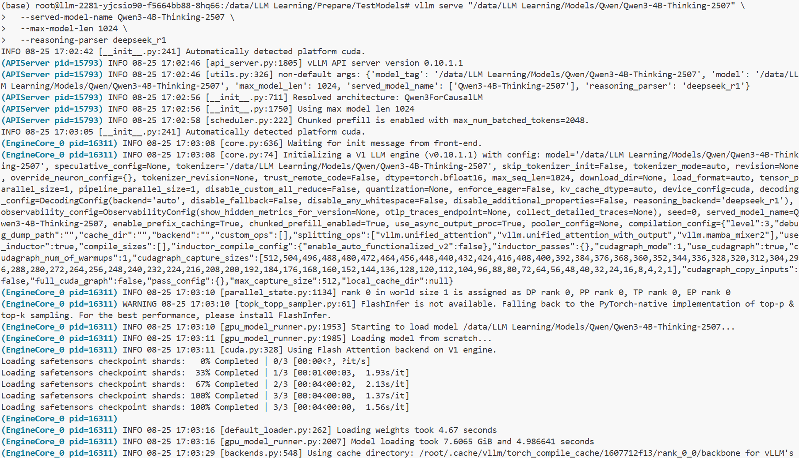

### 第五步：测试 vLLM 模型

在启动 vLLM 服务后，可以使用以下脚本测试模型是否正常工作：

#### test_vllm_integration.py
使用OpenAI兼容的客户端库测试vLLM服务，该脚本会向vLLM服务发送请求并接收响应，验证推理功能是否正常。

#### test_model_with_requests.py
使用Python的requests库直接调用vLLM服务API，提供了一种更底层的测试方式。该脚本包含完整的请求参数和头部信息，方便理解API调用的细节。

测试结果如下：
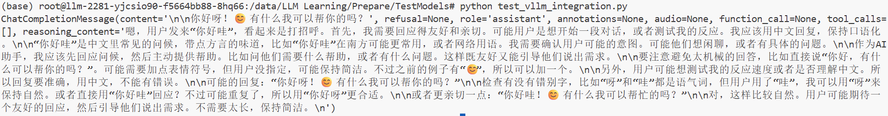

#### vLLM服务日志说明

启动vLLM服务后，后台会输出详细的日志信息，如下图所示：
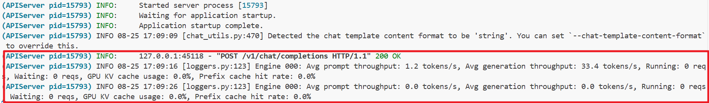

以下是日志的解析：

```
127.0.0.1:45118 - "POST /v1/chat/completions HTTP/1.1" 200 OK
INFO 08-25 17:09:16 [loggers.py:123] Engine 000: Avg prompt throughput: 1.2 tokens/s, Avg generation throughput: 33.4 tokens/s, Running: 0 reqs, Waiting: 0 reqs, GPU KV cache usage: 0.0%, Prefix cache hit rate: 0.0%
```

1. **请求处理信息**：
   - `127.0.0.1:45118`：表示来自本地地址的客户端通过端口45118发起请求
   - `POST /v1/chat/completions HTTP/1.1`：客户端向OpenAI兼容API的聊天完成接口发送了POST请求
   - `200 OK`：服务器成功处理请求并返回200状态码

2. **性能统计指标**：
   - **Avg prompt throughput**: 平均提示词处理吞吐量为每秒1.2个token
   - **Avg generation throughput**: 平均生成吞吐量为每秒33.4个token
   - **Running reqs**: 当前正在运行的请求数量(0个)
   - **Waiting reqs**: 当前等待处理的请求数量(0个)
   - **GPU KV cache usage**: GPU键值缓存使用率(0.0%)
   - **Prefix cache hit rate**: 前缀缓存命中率(0.0%)

这些日志信息对于监控模型服务的性能和健康状况非常有用。

### 第六步：提示词工程学习

提示词工程（Prompt Engineering）是与大语言模型交互的一门艺术和科学，它通过精心设计的提示词来引导模型产生更准确、更相关、更有用的输出。提示词不仅仅是简单的问句，而是一种策略性的输入设计，可以显著影响模型的响应质量和准确性。

在与大语言模型交互时，提示词的质量直接决定了输出的效果。一个精心设计的提示词可以：
- 明确任务目标和期望输出格式
- 提供上下文信息帮助模型更好地理解问题
- 通过示例展示期望的输出模式
- 限制输出范围以提高准确性和相关性
- 引导模型采用特定的思维方式或角色

在本项目中，我们将通过一系列实验来学习提示词工程的技巧和最佳实践。通过对比不同提示词的效果，我们可以直观地看到提示词如何影响模型的输出，从而掌握设计高效提示词的方法。

#### test_prompt_engineering.py

这是提示词工程的第一个实验脚本，演示了如何使用简单的提示词与模型交互。该脚本包含以下功能：

- 使用OpenAI兼容的客户端库连接到本地vLLM服务
- 发送简单的提示词请求（如"教我一句点餐的英文"）
- 处理模型的响应，包括推理过程和最终答案
- 显示使用情况统计信息（tokens消耗等）

脚本特点：
- 使用Qwen3-4B-Thinking-2507模型，支持深度推理能力
- 能够分别显示模型的推理过程和最终答案
- 提供详细的使用情况统计

该脚本是学习提示词工程的良好起点，展示了如何构建基本的提示词并解析模型的响应。

最先的输出如下：
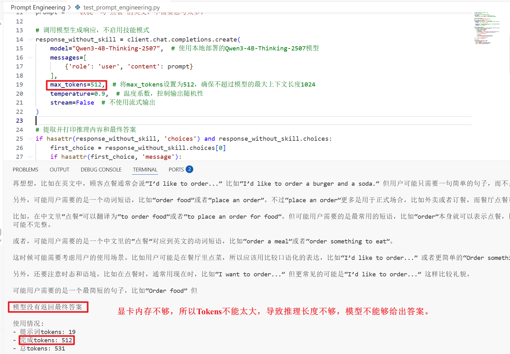
由于设置模型的tokens为1024，所以tokens不能太长，所以对代码进行优化，如下：
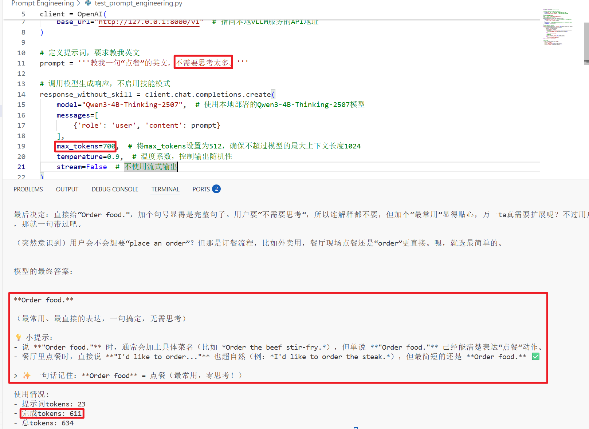
经过提示词工程之后的输出如下：
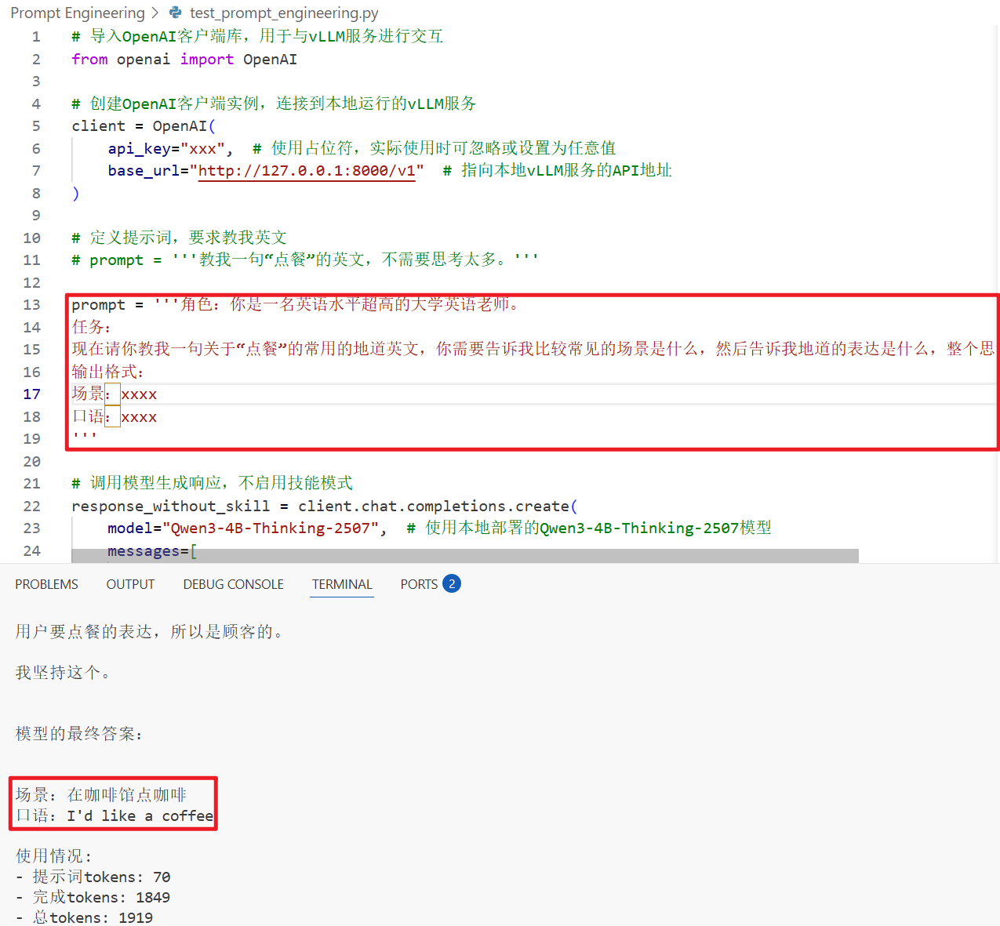
可以看到输出按照我们的格式进行输出了，稍微专业一些了。

### 第七步：模型微调学习

在使用大语言模型时，提示词工程虽然是一种有效的方法，但在某些情况下可能无法很好地解决问题。当遇到以下情况时，我们需要考虑进行模型微调：

1. **领域专业性强**：当需要模型在特定领域（如法律、医学、金融等）表现出专业水平时，仅靠提示词难以让模型准确掌握领域知识。

2. **个性化需求**：当需要模型具备特定的风格、语气或表达方式（如特定人物的说话风格），提示词工程可能无法完全满足需求。

3. **数据隐私要求**：当训练数据涉及敏感信息不能用于提示词构建时，微调可以将这些知识内化到模型中。

4. **性能优化**：当提示词过长影响推理效率和成本时，通过微调可以将知识固化到模型参数中，减少推理时的计算开销。

5. **一致性要求**：当需要模型在大量类似任务中保持高度一致的输出格式和质量时，微调比提示词工程更可靠。

#### 什么是模型微调

模型微调（Fine-tuning）是指在预训练模型的基础上，使用特定领域的数据集对模型参数进行进一步训练，以使模型适应特定任务或领域的方法。相比于从头开始训练模型，微调可以大大减少计算资源和时间成本。

微调的主要方法包括：

- **全量微调**：更新模型的所有参数，效果最好但计算成本最高
- **LoRA（Low-Rank Adaptation）**：只训练模型中的低秩矩阵，大大减少训练参数量，是目前最常用的微调方法之一
- **QLoRA**：在LoRA基础上引入量化技术，进一步降低资源需求

#### 本项目微调实验数据集

本项目使用的微调数据集来自[huanhuan.json](file:///data/LLM%20Learning/Datasets/huanhuan.json)，该数据集包含约18000条对话数据，每条数据包含以下字段：

- **instruction**：指令，描述任务的具体要求
- **input**：输入，可选的额外输入信息
- **output**：输出，期望的模型回答

数据集样例如下：

```
{
  "instruction": "你是谁？",
  "input": "",
  "output": "家父是大理寺少卿甄远道。"
}
```

这些数据来自经典电视剧《甄嬛传》中的对话，通过微调可以让模型学会以剧中人物的风格进行对话。

#### 微调数据预处理脚本

在[Finetune](file:///data/LLM%20Learning/Finetune)目录下，我们提供了[prepare_finetune_data.py](file:///data/LLM%20Learning/Finetune/prepare_finetune_data.py)脚本，用于数据预处理阶段：

- 加载[huanhuan.json](file:///data/LLM%20Learning/Datasets/huanhuan.json)数据集并转换为Hugging Face Dataset格式
- 加载Qwen模型的分词器(tokenizer)
- 应用聊天模板(chat template)生成模型输入格式
- 打印数据集基本信息

该脚本是进行模型微调的第一步，后续将在此基础上进行完整的微调训练流程。

运行之后的输出如下：
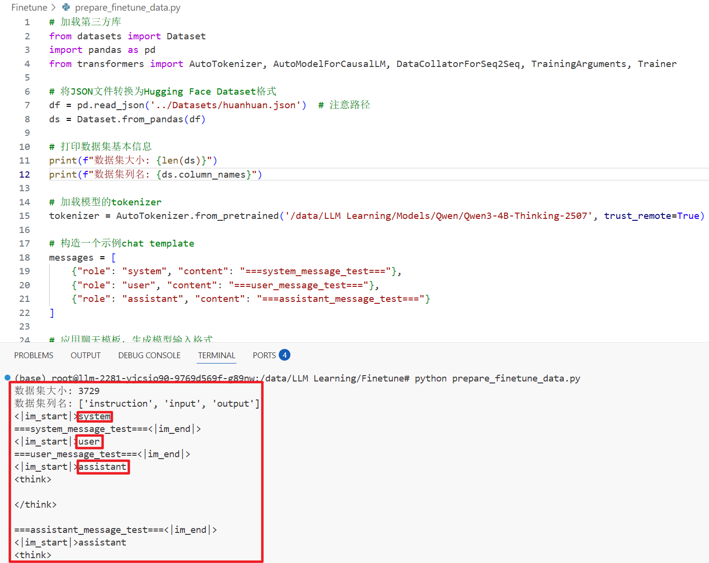
框起来的地方就是我们的Qwen3大模型所需要的输入格式，接下来我们需要按照这个格式进行组织数据。

#### 数据预处理流程详解

数据预处理是模型微调的关键步骤，其目的是将原始对话数据转换为模型可以理解和学习的格式。整个处理流程如下：

1. **数据加载**：首先从[huanhuan.json](file:///data/LLM%20Learning/Datasets/huanhuan.json)文件中读取约18000条对话数据，每条数据包含[instruction]、[input]和[output]三个字段。

2. **构建对话模板**：为了使模型更好地理解对话上下文，我们使用特定的格式构建对话模板：
   - 使用`<im_start>system`和`<im_end>`标记包裹系统消息，设定角色扮演场景（"现在你要扮演皇帝身边的女人--甄嬛"）
   - 使用`<im_start>user`和`<im_end>`标记包裹用户消息，包含具体的[instruction]和[input]内容
   - 使用`<im_start>assistant`和`<im_end>`标记包裹助手消息，并添加``

3. **分词处理**：使用Qwen模型的分词器(tokenizer)对构建好的对话模板进行分词，将文本转换为模型可以理解的token序列。

4. **数据拼接**：将分词后的instruction部分和output部分拼接成完整的输入序列，并在末尾添加pad token作为序列结束的标记。

5. **注意力掩码生成**：生成attention_mask，用来标识序列中哪些token是有效的（值为1），哪些是填充的（值为0）。

6. **标签生成**：生成labels用于训练时计算损失函数：
   - 对于instruction部分，设置为-100表示这些位置不计算损失（模型不需要预测这部分内容）
   - 对于output部分，保留原始token ID，表示这些是模型需要预测的内容
   - 序列末尾同样添加pad token

7. **长度截断**：由于Qwen3模型的最大上下文长度为1024个token，如果拼接后的序列超过这个长度，需要进行截断处理。

8. **数据处理执行**：使用Hugging Face的map函数对整个数据集应用处理函数，将所有原始数据转换为模型训练所需的格式，并移除原始数据列以节省内存。

通过以上步骤，原始的对话数据就被转换为了适合模型微调的格式，为后续的微调训练做好了准备。
运行之后的输出如下：
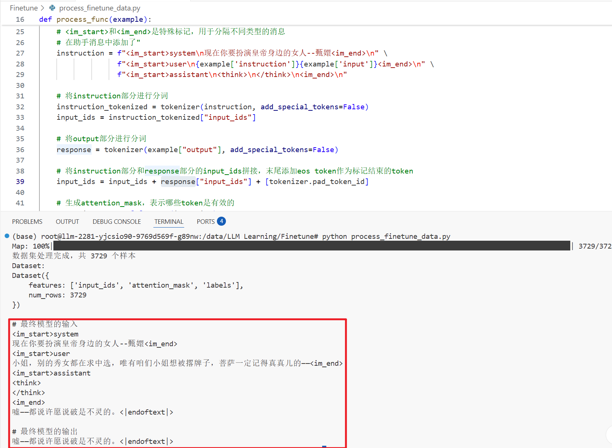

#### 全量微调

全量微调（Full Fine-tuning）是指更新预训练模型的所有参数以适应特定任务的方法。这种方法通常能获得最佳的性能提升，但需要更多的计算资源和时间。

在本项目中，我们提供了[train_full_finetune.py](file:///data/LLM%20Learning/Finetune/train_full_finetune.py)脚本用于执行Qwen3-0.6B模型的全量微调。该脚本的主要特点包括：

- 使用Qwen3-0.6B作为基础模型进行微调
- 采用BF16精度训练以平衡性能和计算效率
- 启用梯度检查点（Gradient Checkpointing）以降低显存占用
- 使用Hugging Face Transformers框架和Trainer API进行训练

##### 训练配置

[train_full_finetune.py](file:///data/LLM%20Learning/Finetune/train_full_finetune.py)脚本中的训练配置如下：

- **模型**: Qwen3-0.6B
- **数据集**: huanhuan.json（约18000条对话数据）
- **训练轮数**: 3轮
- **批次大小**: 每设备8个样本，梯度累积2步
- **学习率**: 1e-4
- **序列长度**: 最大1024个token
- **精度**: BF16训练
- **优化技术**: 梯度检查点、权重衰减

##### 数据处理

与[prepare_finetune_data.py](file:///data/LLM%20Learning/Finetune/prepare_finetune_data.py)不同，[train_full_finetune.py](file:///data/LLM%20Learning/Finetune/train_full_finetune.py)中包含了完整的数据处理流程：

1. 从[huanhuan.json](file:///data/LLM%20Learning/Datasets/huanhuan.json)加载数据集
2. 使用Qwen3-0.6B的tokenizer进行分词
3. 构建对话模板，包含系统消息、用户消息和助手消息
4. 生成input_ids、attention_mask和labels
5. 对序列进行填充或截断以保持统一长度
6. 将数据集划分为训练集（90%）和验证集（10%）

##### 训练过程

训练过程中采用了以下优化措施：

- **梯度检查点**: 通过[model.enable_input_require_grads()](file:///data/LLM%20Learning/Finetune/train_full_finetune.py#L14-L14)和[gradient_checkpointing=True](file:///data/LLM%20Learning/Finetune/train_full_finetune.py#L84-L84)降低显存占用
- **混合精度训练**: 使用BF16精度加快训练速度并减少显存使用
- **评估策略**: 每50步进行一次验证集评估
- **模型保存**: 每100步保存一次检查点，最多保存3个检查点
- **早停机制**: 根据验证损失选择最佳模型

训练完成后，模型将保存在[output/Qwen3_0.6B](file:///data/LLM%20Learning/Finetune/output/Qwen3_0.6B)目录中，可用于后续的推理任务。

训练输出的内容如下：
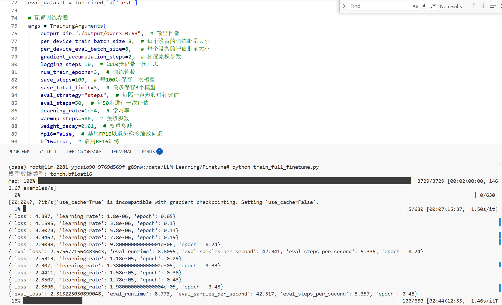

#### LoRA微调

LoRA（Low-Rank Adaptation）微调是一种轻量级的模型微调方法，它通过只训练模型中的低秩矩阵来大大减少训练参数量，从而降低计算资源需求。

在本项目中，我们提供了[train_lora_finetune.py](file:///data/LLM%20Learning/Finetune/train_lora_finetune.py)脚本用于执行Qwen3-4B-Thinking模型的LoRA微调。该脚本的主要特点包括：

- 使用Qwen3-4B-Thinking作为基础模型进行微调
- 采用LoRA技术进行轻量级微调，只更新少量参数
- 采用BF16精度训练以平衡性能和计算效率
- 启用梯度检查点（Gradient Checkpointing）以降低显存占用
- 使用Hugging Face Transformers框架和Trainer API进行训练

##### 训练配置

[train_lora_finetune.py](file:///data/LLM%20Learning/Finetune/train_lora_finetune.py)脚本中的训练配置如下：

- **模型**: Qwen3-4B-Thinking
- **数据集**: huanhuan.json（约18000条对话数据）
- **训练轮数**: 3轮
- **批次大小**: 每设备8个样本，梯度累积2步
- **学习率**: 1e-4
- **序列长度**: 最大1024个token
- **精度**: BF16训练
- **LoRA配置**:
  - r=8（LoRA秩）
  - lora_alpha=32（LoRA alpha值）
  - lora_dropout=0.1（Dropout比例）
  - target_modules=["q_proj", "k_proj", "v_proj", "o_proj", "gate_proj", "up_proj", "down_proj"]（目标模块）

训练输出内容如下：
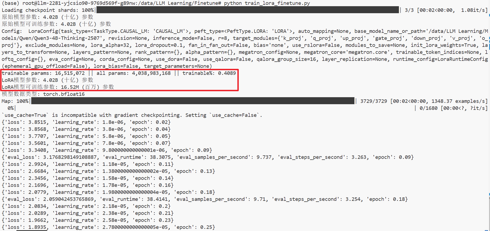

##### 参数对比

通过[train_lora_finetune.py](file:///data/LLM%20Learning/Finetune/train_lora_finetune.py)脚本，我们可以清楚地看到LoRA微调与全量微调之间的参数对比：

- **原始模型参数**: 约4.02B (十亿) 参数
- **原始模型可训练参数**: 约4.02B (十亿) 参数
- **LoRA模型可训练参数**: 约16.52M (百万) 参数

这表明LoRA微调相比全量微调大大减少了需要训练的参数数量，从而显著降低了计算资源需求。

##### 数据处理

与全量微调类似，LoRA微调也使用相同的数据处理流程：

1. 从[huanhuan.json](file:///data/LLM%20Learning/Datasets/huanhuan.json)加载数据集
2. 使用Qwen3-4B-Thinking的tokenizer进行分词
3. 构建对话模板，包含系统消息、用户消息和助手消息
4. 生成input_ids、attention_mask和labels
5. 对序列进行填充或截断以保持统一长度
6. 将数据集划分为训练集（90%）和验证集（10%）

##### 训练过程

训练过程中采用了与全量微调相同的优化措施：

- **梯度检查点**: 通过[model.enable_input_require_grads()](file:///data/LLM%20Learning/Finetune/train_lora_finetune.py#L31-L31)和[gradient_checkpointing=True](file:///data/LLM%20Learning/Finetune/train_lora_finetune.py#L112-L112)降低显存占用
- **混合精度训练**: 使用BF16精度加快训练速度并减少显存使用
- **评估策略**: 每50步进行一次验证集评估
- **模型保存**: 每100步保存一次检查点，最多保存3个检查点
- **早停机制**: 根据验证损失选择最佳模型

训练完成后，模型将保存在[output/Qwen3_4B-lora](file:///data/LLM%20Learning/Finetune/output/Qwen3_4B-lora)目录中，可用于后续的推理任务。

#### 测试LoRA微调模型

在完成LoRA微调训练后，我们可以使用[test_lora_model.py](file:///data/LLM%20Learning/Finetune/test_lora_model.py)脚本来测试训练好的模型。该脚本的主要功能包括：

- 加载基础模型和LoRA微调权重
- 构造测试对话并应用聊天模板
- 配置生成参数
- 进行推理并输出结果

通过这个脚本，我们可以验证LoRA微调模型的效果，并与原始模型进行对比。

经过微调之后，我们再问模型“你是谁”，结果如下：
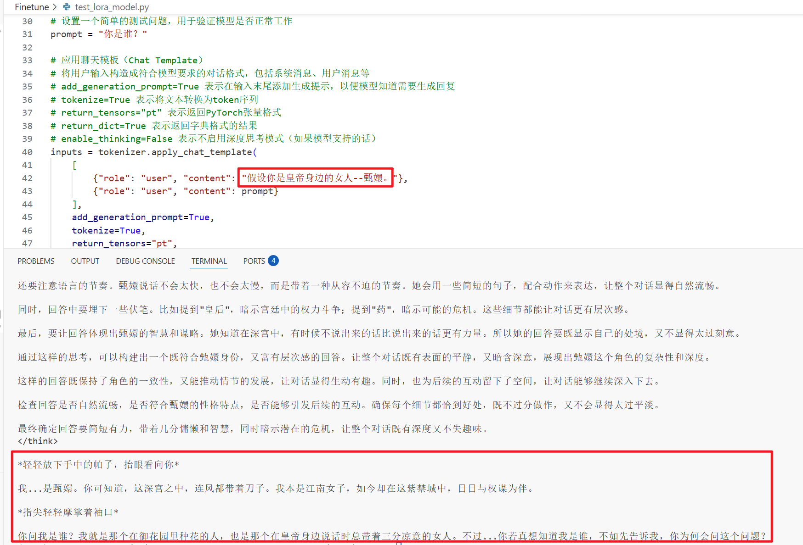
可以看到，现在的语气和语境与甄嬛还是非常相似的了。

## Qwen3-4B-Thinking-2507模型特性

Qwen3-4B-Thinking-2507是阿里巴巴Qwen系列模型中的深度推理版本，具有以下特性：

- **深度推理能力**: 支持复杂任务的逐步思考和推理过程
- **长文本理解**: 最大支持256K tokens的上下文长度
- **思维链解析**: 能够分离思考过程和最终答案
- **多语言支持**: 支持多种语言的高质量理解和生成

## 技术栈

- **ModelScope**: 用于模型下载
- **Transformers**: 用于加载和运行模型
- **PyTorch**: 深度学习框架
- **vLLM**: 用于高效推理服务
- **OpenAI客户端库**: 用于调用vLLM的OpenAI兼容接口
- **requests**: 用于直接调用vLLM API